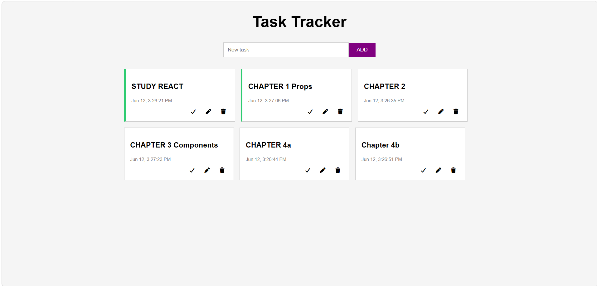

# To-Do App

## Description

This project is a To-Do application built with React. It allows users to add, edit, complete, and delete tasks. The application uses the useReducer hook for state management and localStorage to save tasks when the page is refreshed.

## Screenshot

## Features

- Add new tasks
- Edit existing tasks
- Mark tasks as complete
- Delete tasks
- Save tasks using localStorage
- Font Awesome icons for actions

## Technologies Used

- React
- JavaScript
- CSS
- useReducer
- localStorage
- Font Awesome

## GitHub Pages

https://daljitkaur08.github.io/to-do

## Author

Daljit Kaur